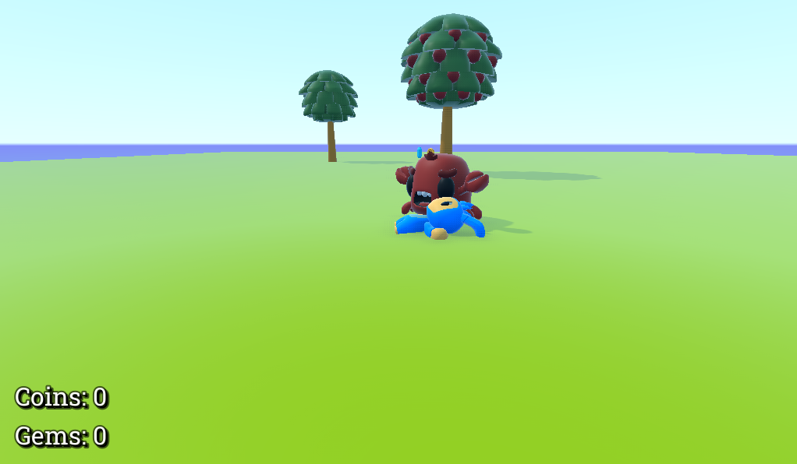

# Introduction to game 3D

This is an introduction to the 3d game, with enemies, item collections and collisions

## Tecnologias

Esse projeto foi desenvolvido com as seguintes tecnologias:

- [Godot Engine](https://godotengine.org/)

## Screenshot

  

## Features

- [x] Avoid obstacles (collision)
- [x] Animation on walk/idle
- [x] Attack with animation
- [x] Player & monster stats
- [x] Monsters tries to reach the player
- [x] Monsters attacks
- [x] Player dies
- [] UI bars
- [x] Monsters wander around when player's near
- [] A-Star algorithm when monsters trying to reach the player
- [x] A cool map
- [x] Animation on attack
- [] Stats bars on monsters
- [x] Ranged monsters and weapons

